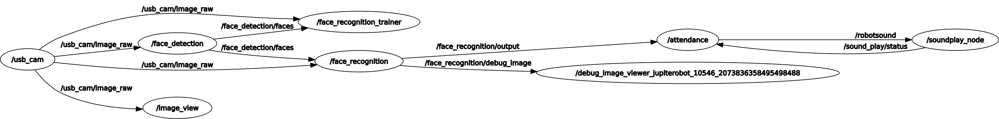

# Robot

save `Attendance.launch` in `/home/mustar/catkin_ws/src/rc-home-edu-learn-ros/rchomeedu_vision/launch`

save `Attendance.py` in `/home/mustar/catkin_ws/src/rc-home-edu-learn-ros/rchomeedu_vision/scripts`

```bash
$ catkin_make
```

```bash
$ roslaunch usb_cam usb_cam-test.launch
```

```bash
$ roslaunch opencv_apps face_recognition.launch image:=/usb_cam/image_raw
```

```bash
$ roslaunch rchomeedu_vision Attendance.launch
```



